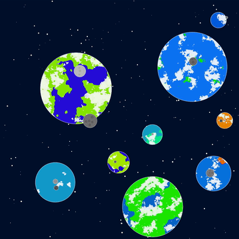
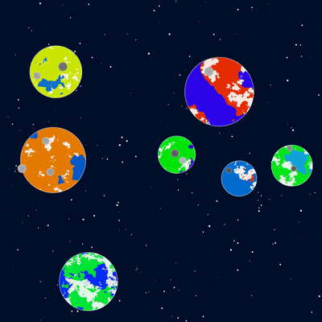

# Planets

A while back I wanted to play around with [circle packing](https://en.wikipedia.org/wiki/Circle_packing), the study of the arrangements of a set of circles in a plane.

So I started creating something that became what you can see on this page.
The space is filled sparsely with planets, each of them having a certain number of moons.
Each planet has its own surface and atmosphere, while each moon features only a variable number of craters.

The textures for each planet are generating making use of the [Simplex noise](https://en.wikipedia.org/wiki/Simplex_noise), a very computationally heavy pseudo number generation algorithm.
In order to speed up the drawing, the textures are saved as images and don't need to be drawn by scratch each frame.

Finally, in the background there is a large amount of stars, slowly blinking around.
I picked their color to be the same as the [cosmic latte](https://en.wikipedia.org/wiki/Cosmic_latte), the average color of the universe.
Despite being really wrong from a scientific point of view, I wanted to give to this video something slightly realistic.

As always, you can check out the rendered output on my [Instagram profile](https://instagram.com/lorossi97) or you can see some gifs on this very page, just a few lines below.

If you are feeling it you can also [try it out here]().

## Output

## Credits

This project is released under MIT License.
